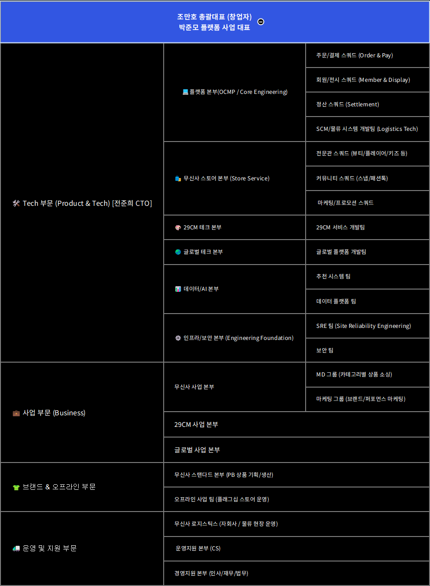

# 무신사

## 연혁
- 2001년 프리챌에서 온라인 커뮤니티 '무지하게 신발 사진 많은 곳'으로 시작
  - 2002년 프리챌 유료화 이슈로 독립 사이트 무신사닷컴 오픈
  - 2005년 온오프라인 매거진 무신사 매거진 발행 (무신사닷컴 회원 15만명 돌파)
  - 2008년 무신사닷컴 회원 25만명 돌파 (모회사 그레이큐브 설립)
  - 2009년 온라인 패션 스토어 무신사 스토어 오픈
  - 2011년 입점 브랜드 100개 돌파 (무신사닷컴 회원 39만명 돌파)
  - 2012년 (주)그랩 법인사업자 등록
  - 2013년 연간 총 거래액 100억 돌파
  - 2014년 연간 총 거래액 240억 돌파
  - 2015년 연간 총 거래액 1000억 달성
  - 2016년 우신사 런칭
  - 2017년 무신사 스탠다드 론칭
  - 2019년 세콰이어캐피탈 2천억 유치하며 유니콘 선정,
      - 무신사 DF 오픈
      - 무신사 스냅 론칭
      - 무신사TV 개국
      - (주)그랩 -> (주)무신사로 법인명 변경
  - 2021년 강정구 & 한문일 공동대표 선임
  - 2022년 한문일 단독 대표 전환
      - 무신사 키즈 오픈
      - 무신사 스튜디오 한남점 오픈

## 계열사
- 무신사파트너스
    - 2018년 설립된 패션 브랜드 및 스타트업 전문기업
  - 에스엘디티
      - SLDT. 솔드아웃 서비스운영
  - 무신사로지스틱스
      - 2017년 설립된 물류 전문 자회사
  - 무신사트레이딩
      - 2024년 EMPTY 사업부문을 영업양수
  - 어바웃블랭크앤코
      - 2021년 인수한 브랜드 매니지먼트 회사
  - 에스에스여주피에프브이
      - 2021년 설립한 부동산 개발 법인. 여주에 물류센터
  - 오리지널랩
      - 2020년 설립된 패션 전문 MCN 기업
  - 무신사랩
      - 2022년 설립된 CQR 서비스 운영
  - 워즈코퍼레이션
      - 예일,  피지컬에듀케이션디파트먼트, 팀코믹스, 래리클락, 혼다 브랜드를 전개하는 의류 제조 회사.
  - 무신사페이먼츠
  - 에스티디씨
      - STDC. 무신사 스탠다드 운영

## 매출
- 2025년
    - 3분기 누적 매출 9,730억, 누적 이익 706억
- 2024년
    - 매출 12,427억, 이익 1,028억
- 2023년
    - 매출 9,931억, 이익 -86억

### 매출 구분
- 수수료 매출 39.0% (플랫폼 입점사 판매 중개비)
  - 상품 매출 30.3% (국내외 디자이너 브랜드 및 글로벌 브랜드 유통 관련 매출)
  - 제품 매출 27.2% (자체 기획 브랜드 매출)
  - 기타  3.5%

### 매출 실적
- 내수 99% 이상

## 직원수
- 전체 직원 수
    - 1,836명 (작년 12월 기준 1600명, 채용 확대 중)
    - 27년까지 전체 인력의 40% 테크 인력으로 충원예정
- 최근 1년 입사율 38.4%
- 최근 1년 퇴사율 26.1%
    - IT 퇴사율 약 15%

## 사용자 (월간)
- 25년 9월 703만명
- 24년 6월 549만명

## 비전
- 파트너 브랜드의 성장을 돕고 성공을 나눕니다.
    - 무신사는 파트너 브랜드와 ‘성공’이라는 공동의 목적을 가지고 함께 성장합니다. 파트너 브랜드는 패션에 몰입하고 무신사는 비즈니스에 몰두하며, 전략적 파트너로서 하나의 목표를 이루기 위해 노력합니다. 서로의 성장이 성공과 직결되는 긴밀한 관계로서, 각자의 역할에 최선을 다해 최고의 결과를 만들어냅니다.

- 누구나 자신만의 멋을 쉽게 찾을 수 있는 다양한 경험을 제공합니다.
    - 무신사는 획일화된 멋이 아닌, 각자의 개성을 표현할 수 있는 다양한 패션 브랜드를 끊임없이 새롭게 발굴하고 제공합니다. 언제 어디서든 모두가 쉽고 편리하게 패션을 접하고 구매할 수 있는 다양한 기회를 제안합니다. 또한, 다채로운 스타일을 공유하고 자유롭게 소통하는 커뮤니티로서의 역할도 주도적으로 해나가고 있습니다.

- 대한민국 패션의 위상을 널리 알리고 발전에 기여합니다.
    - 무신사는 대한민국 패션을 세계로 알리기 위해 노력합니다. 패션 산업이 다음 단계로 도약하기 위한 다양한 인프라를 구축하고, 성공적인 글로벌 진출의 판로를 제시합니다. 패션 산업의 미래를 이끌어나갈 새로운 인재를 발굴하고 양성하는 것 역시 무신사의 역할입니다.

### 비전 활동
- 무신사 스튜디오
    - 패션 스타트업을 지원하기 위한 동반성장 프로젝트
    - 신진 디자이너 발굴 및 육성 지원도 함
        - 2018년 서울 동대문 1호점
        - 2022년 한남 1,2호점 , 성수점
        - 2023년 신당점

- 무신사 파트너스 : 중소브랜드 및 스타트업 투자
    - 25년 기준 투자 건수는 80여견
    - 누적 투자금액 1,000

## CTO
- 2022년 조연
    - 우형 베트남법인 CTO 출신 (우형 인력 들여왔다함.)
    - 기술 고도화 투자 확대 및 글로벌 확장 과정 역량 기대

- 2023년 조연 사퇴 후 한문일 대표 겸업
    - CTO 인선없이 본부 체제로 기술 파트 운영 계획
    - 기존 산하 조직은 플랫폼 본부 등의 체제로 운영
        - 각 서비스(도메인)별 본부장 및 CPO이 역할했다함
        - 이희창 이라는 분이 CTO 역할을 했다고 함.

- 2024년 전준희
    - 요기요 CTO, 쿠팡 부사장 출신
    - AI 활용한 OCMP(One Core Multi Platform) 추진 핵심 역할
        - 글로벌 확장을 위한 글로벌 스탠다드 시스템 구축
        - 무신사, 29CM, 솔드 아웃 등 서비스가 독립적
          이를 아우르는 '하나의 거대한 기술 코어(Platform)'이 목적
        - 데이터, 고객, 운영 등 플랫폼 간 공통 영역을 하나의 코어 체계

## 일하는 방식
- 고객과 브랜드 중심의 사고
    - 항상 고객과 파트너 브랜드의 입장에서 생각하고 행동합니다.

- 오너십
    - 각자의 업무에 주인의식을 갖고 책임감 있게 임합니다.

- 학습역량
    - 끊임없이 배우고 성장하며 새로운 지식을 습득합니다.

- 결과 집중
    - 과정뿐 아니라 결과에 집중하고 목표 달성을 위해 노력합니다.

- 단순화
    - 복잡한 문제를 단순하게 만들고 본질에 집중하여 효율적으로 일합니다.

- 높은 기준
    - 항상 높은 목표를 설정하고 탁월한 성과를 추구합니다.

- 경계를 넘는 협업
    - 부서 간의 경계를 넘어 적극적으로 소통하고 협력합니다.

### 기술 블로그
#### PHP 레거시에서 Kotlin/MSA로의 대전환
- 배경 : 초기 무신사는 PHP 기반의 모놀리식(Monolithic) 구조였습니다. 트래픽이 폭증하고 개발자가 늘어나면서 배포가 느려지고 장애가 잦아졌습니다.
- 해결 방법
    - Strangler Fig 패턴: 빅뱅 방식(한 번에 교체)이 아니라, 기능을 하나씩 떼어내어 Kotlin & Spring Boot 기반의 MSA로 전환했습니다.
    - 성과: 주문, 결제, 전시 등 핵심 도메인을 마이크로서비스로 분리하여 독립적인 배포와 확장이 가능해졌습니다.

#### OCMP (One Core Multi Platform) 구축 시작
- 배경 : 29CM, 솔드아웃 등을 인수하면서 플랫폼은 늘어났는데, 로그인, 결제, 정산 시스템이 다 따로 놀았습니다.
- 해결 : 전사 공통 기능을 묶는 **'플랫폼 본부'**를 신설하고, 통합 회원(SSO), 통합 결제, 통합 파트너 센터를 구축하기 시작했습니다.

#### 블랙프라이데이(무진장) 트래픽 방어
- 배경 : 연중 최대 행사인 '무진장 블프' 때 트래픽이 평소의 수십 배로 폭주합니다.
- 해결 방법 :
    - 캐싱 전략: Redis를 적극 활용하여 DB 부하를 줄였습니다.
    - 비동기 처리: 주문 폭주 시 Kafka를 이용해 트래픽을 완충(Throttling)하고, 순차적으로 처리하여 서버 다운을 막았습니다.
    - 탄력적 인프라: Kubernetes(EKS) 기반의 Auto-scaling을 고도화했습니다.

#### 적극적인 AI 활용 및 도입
- AI와의 성공적인 첫 Co Work — 바이브 코딩으로 탄생된 맞춤형 Testcase Management System (29TMS) https://medium.com/musinsa-tech/ai와의-성공적인-첫-co-work-바이브-코딩으로-탄생된-맞춤형-testcase-management-system-29tms-74062a620119
- AI와 함께 테스트 코드 작성 하기: 리팩토링과 PR 자동화까지  https://medium.com/musinsa-tech/ai와-함께-테스트-코드-작성-하기-8a04225ed51a
- Spring AI와 Typesense로 1,400명의 질문에 답변하기
  https://medium.com/musinsa-tech/spring-ai와-typesense로-1-400명의-질문에-답변하기-6d9a779892c8
- 무슨사이(MUSNSAI) AI 해커톤 운영기: AI와 함께, 코드가 워킹한다
  https://medium.com/musinsa-tech/무슨사이-musnsai-ai-해커톤-운영기-ai와-함께-코드가-워킹한다-594d5d2a8f24

## 조직도

## 서비스

### 무신사 스토어
- 🎯 개인화 추천 서비스 (Recommendation & Discovery)
    - "사용자의 취향을 분석하여 맞춤형 상품을 보여준다."
    - 서비스 내용:
        - 알고리즘 추천: "OOO님을 위한 추천 아이템", "이 상품을 본 다른 고객이 산 상품" 등 AI 기반 추천.
        - 개인화 피드: 사용자의 조회, 장바구니, 구매 이력, 좋아요 데이터를 분석해 홈 화면 구성을 사람마다 다르게 보여줌.
    - 👨‍💻 백엔드 관점 (Tech):
        - 대규모 유저 로그(User Behavior Log) 수집 및 분석.
        - 머신러닝(ML) 모델 서빙 및 실시간 추론.
        - Personalization Engineering 팀의 핵심 업무 영역.

- 🏆 랭킹 시스템 (Ranking System)
    - "현재 대한민국의 패션 트렌드를 실시간으로 보여준다"
    - 서비스 내용:
        - 실시간 랭킹: 지금 가장 많이 팔리고 보고 있는 상품 순위.
        - 카테고리별 랭킹: 상의, 바지, 아우터 등 세부 카테고리별 순위.
        - 급상승 랭킹: 짧은 시간 내에 트래픽이 폭주하는 상품 포착.
    - 👨‍💻 백엔드 관점 (Tech):
        - 판매량, 조회수, 후기 수 등 다양한 가중치를 계산하여 정렬.
        - Redis를 활용한 고속 데이터 처리 및 캐싱 전략 필수.
        - Ranking 백엔드 엔지니어 공고와 직결됨.

- 📸 콘텐츠 & 커뮤니티 (Content & Snap)
    - "쇼핑을 넘어 패션 문화를 소비하게 한다."
    - 서비스 내용:
        - 무신사 스냅 (Snap): 거리의 패션 피플이나 인플루언서들의 착용 샷(OOTD) 공유.
        - 매거진/TV: 에디터가 작성한 패션 뉴스, 룩북, 영상 콘텐츠.
        - 코디숍/코디맵: 상품을 활용한 스타일링 제안.
    - 백엔드 관점 (Tech):
        - 이미지/영상 대용량 트래픽 처리.
        - 콘텐츠 내 상품 태깅(Tagging) 및 커머스 연동 로직.
        - 소셜 기능(좋아요, 댓글, 팔로우) 구현.

- 🛍️ 버티컬 전문관 (Vertical Services)
    - "패션 안에서도 세분화된 니즈를 공략한다."
    - 서비스 내용:
        - 뷰티 (Beauty): 화장품 전문관.
        - 플레이어 (Player): 스포츠/레저 전문관.
        - 부티크 (Boutique): 럭셔리 명품관.
        - 어스 (Earth): 지속가능한 패션.
        - 키즈 (Kids): 아동복.
    - 👨‍💻 백엔드 관점 (Tech):
        - 각 카테고리(화장품 vs 옷 vs 명품)마다 다른 **상품 속성(Attribute)**과 필터링 로직을 유연하게 처리하는 DB 설계가 핵심.
        - OCMP(One Core Multi Platform) 전략 하에 공통 코어를 재사용하면서 전문관 특화 기능을 붙이는 구조.

- 🎟️ 마케팅 & 혜택 (Marketing & Benefit)
    - "사용자를 락인(Lock-in)하고 구매를 유도한다."
    - 서비스 내용:
        - 래플 (Draw): 한정판 스니커즈 추첨 발매.
        - 선착순 특가: 특정 시간에 열리는 할인 이벤트.
        - 쿠폰/적립금: 등급별 혜택 및 적용.
    - 👨‍💻 백엔드 관점 (Tech):
        - 순간적인 트래픽 폭주(Traffic Spike)를 견디는 대용량 아키텍처 (Kafka, 대기열 시스템).
        - 선착순 쿠폰 등 동시성 이슈 해결이 가장 중요한 영역.

### 29CM
#### 📖 미디어 커머스 & 콘텐츠 (Content & Storytelling)
- "물건을 파는 게 아니라, 브랜드의 이야기를 판다." (29CM의 정체성)
- 서비스 내용:
    - PT (Online Presentation): 브랜드를 깊이 있게 소개하는 온라인 프레젠테이션. 단순 상세페이지가 아니라 매거진 - 화보처럼 구성됩니다.
    - 웰컴(Welove): 29CM 에디터가 직접 큐레이션 한 브랜드 스토리.
- 👨‍💻 백엔드 관점 (Tech):
    - CMS (Content Management System): 단순 상품 등록이 아니라, 콘텐츠와 상품을 N:N으로 매핑하고 관리하는 구조가 - 복잡합니다.
    - 전시 로직: 사용자의 취향에 따라 "어떤 콘텐츠를 먼저 보여줄지" 결정하는 전시 알고리즘이 중요합니다. (채용공고의 '전시/콘텐츠' 팀 업무)
#### 🎁 선물하기 (Gifting)
- "나를 위한 소비에서, 타인을 위한 소비로 확장." (핵심 성장 동력)
- 서비스 내용:
    - 선물하기: 상대방 주소를 몰라도 연락처만으로 선물을 보낼 수 있는 기능.
    - 메시지 카드: 감성적인 일러스트 카드와 함께 메시지 전송.
- 👨‍💻 백엔드 관점 (Tech):
    - 주문 프로세스의 분리: 주문자(Buyer)와 수령자(Receiver)가 다르고, 배송지 입력 시점이 결제 이후에 발생합니다. - 일반 주문과는 다른 **복잡한 상태 관리(State Machine)**가 필요합니다.
    - 링크 유효기간 관리: 선물 수락/거절/만료 처리를 위한 스케줄링 및 알림 시스템.
#### 🛋️ 라이프스타일 큐레이션 (Lifestyle Vertical)
- "옷장(Fashion)을 넘어 방(Living)과 취미(Culture)까지."
- 서비스 내용:
    - 카테고리 확장: 의류뿐만 아니라 가구, 조명, 가전(테크), 캠핑 등 다양한 카테고리를 취급합니다.
    - 이구홈(29Home): 리빙 전문관.
- 👨‍💻 백엔드 관점 (Tech):
    - 유연한 데이터 모델링: '티셔츠(사이즈/색상)'와 '소파(가죽재질/배송일지정)'는 속성이 완전히 다릅니다. 이를 하나의 DB 구조에서 처리하기 위한 EAV(Entity-Attribute-Value) 패턴이나 NoSQL(Document DB) 활용이 필요합니다.
#### 📅 수요입점회 & 이구위크 (Event & Drop)
- "한정된 기간, 강력한 혜택으로 트래픽을 모은다."
- 서비스 내용:
    - 수요입점회: 매주 수요일 신규 입점 브랜드를 29% 할인된 가격에 소개.
    - 이구위크: 대규모 정기 할인 행사.
    - 리미티드 오더: 한정 수량 선착순 판매.
- 👨‍💻 백엔드 관점 (Tech):
    - 특정 요일/시간에 트래픽이 몰리는 구조입니다. (무신사의 선착순 특가와 유사)
    - 대기열 시스템 및 **재고 동시성 제어(Redis)**가 필수적입니다.
#### 📺 이구라이브 (Live Commerce)
- "영상으로 소통하며 실시간으로 판매한다."
- 서비스 내용:
    - 29CM만의 감성으로 진행하는 라이브 방송.
    - 실시간 채팅 및 방송 중 상품 구매 기능.
- 👨‍💻 백엔드 관점 (Tech):
    - 실시간 채팅 서버: 웹소켓(WebSocket)을 이용한 대용량 양방향 통신.
    - 타임라인 매핑: 영상의 특정 시간대에 특정 상품 배너를 띄우는 동기화 기술.

### 솔드 아웃
#### 📈 주식 시장 같은 거래 시스템 (Trading Platform)
- "상품의 가격이 정해져 있지 않고, 주식처럼 실시간으로 변한다."
- 서비스 내용:
    - 입찰(Bidding): 판매자는 "이 가격에 팔래(판매 입찰)", 구매자는 "이 가격에 살래(구매 입찰)"를 올립니다.
    - 체결(Matching): 판매가와 구매가가 일치하는 순간 거래가 성사됩니다. (주식 시장의 매수/매도와 동일)
    - 시세 그래프: 최근 거래 체결가, 가격 변동 추이를 차트로 보여줍니다.
- 👨‍💻 백엔드 관점 (Tech):
    - 주문 매칭 엔진 (Order Matching Engine): 일반적인 쇼핑몰의 장바구니 -> 주문 로직이 아닙니다. 구매 희망가와 - 판매 희망가를 실시간으로 비교하고 매칭하는 고성능 알고리즘이 필요합니다.
    - 동시성 제어: 가격이 급변하는 인기 신발의 경우, 0.1초 차이로 체결 여부가 갈리므로 Redis 등을 활용한 정밀한 락(Lock) 관리가 필수입니다.
#### 🔍 검수 및 물류 센터 (Inspection & Logistics)
- "판매자가 구매자에게 바로 보내지 않고, 솔드아웃 센터를 거쳐간다."
- 서비스 내용:
    - 검수 시스템: 판매자 발송 -> 솔드아웃 센터 입고 -> 정품/가품 감정 -> (합격 시) 구매자 배송.
    - 창고 보관 판매: 판매자가 미리 솔드아웃 창고에 물건을 보내놓고, 팔리면 바로 배송하는 '빠른 배송' 서비스.
- 👨‍💻 백엔드 관점 (Tech):
    - 복잡한 상태 관리 (State Machine): 입고 대기 -> 입고 완료 -> 검수 중 -> 검수 합격/불합격 -> 정산 대기 주문의 상태(Status)가 매우 세분화되어 있습니다.
    - 이미지 처리: 검수 과정에서 촬영한 수많은 사진 데이터를 효율적으로 저장하고 관리해야 합니다.
#### 💸 에스크로 결제 & 정산 (Escrow & Settlement)
- "돈을 잠시 보관했다가, 검수가 끝나면 지급한다."
- 서비스 내용:
    - 결제 보류 (Holding): 구매자가 결제해도 판매자에게 바로 돈이 가지 않습니다.
    - 정산 지급: 검수 합격 시점에 판매자에게 수수료를 떼고 입금합니다.
    - 페널티 부과: 판매자가 가품을 보내거나 발송을 안 하면, 등록된 카드에서 벌금을 결제합니다.
- 👨‍💻 백엔드 관점 (Tech):
    - 일반 커머스보다 정산 로직이 훨씬 복잡합니다. (구매 확정 시점이 배송 완료 후 검수까지 끝난 시점이기 때문)
    - 페널티 자동 결제 시스템 구축이 필요합니다.
#### 🎟️ 래플 & 드롭 (Raffle & Drops)
- "한정판 발매 시 순간 트래픽이 폭발한다."
- 서비스 내용:
    - 래플(Draw): 나이키 한정판 등을 추첨으로 100원이나 정가에 구매할 기회 제공.
    - 드롭: 특정 시간에 선착순 판매.
- 👨‍💻 백엔드 관점 (Tech):
    - 무신사의 래플과 마찬가지로 대용량 트래픽 처리가 핵심입니다.
    - 수십만 명이 동시에 응모 버튼을 누를 때 서버가 죽지 않도록 Kafka로 대기열을 만들고 비동기로 처리합니다.

## Job Description
### Backend Engineer (29CM / 커스터머인게이지먼트)
- 핵심 키워드: 전시, 콘텐츠, 선물하기, BFF API
  - 주요 업무:
    - 전시/콘텐츠 영역 책임 및 고객에게 최적의 콘텐츠 제공
    - 선물하기, 좋아요, 체험단, 래플 등 발견/탐색 기능 설계 및 개발
    - Frontend/Mobile에 최적화된 BFF(Backend For Frontend) API 개발
    - 대규모 트래픽 처리를 위한 시스템 설계 및 데이터 파이프라인 구축
  - 자격 요건:
      -  개발 경력 7년 이상 (또는 준하는 역량)
      -  Java/Kotlin, Spring/JPA 활용 능력 필수
      -  클라우드 환경 하의 Server, Network, DB 이해
  - 기술 스택:
    - Java, Kotlin, Spring Boot, JPA, AWS, Kubernetes
  - 우대 사항:
      - 전시, 콘텐츠, 기획전, 선물하기 도메인 경험
      - 이커머스 주요 도메인 경험 및 대용량 트래픽 아키텍처 설계 경험
      - AWS, Kubernetes 환경 서비스 운영 경험

## Backend Engineer (29CM / 커머스코어)
- 핵심 키워드: 주문, 결제, 정산, 안정성, 대용량 트래픽
- 주요 업무:
    -  29CM 서비스의 주문, 결제, 배송, 클레임, 정산 시스템 개선 및 고도화
    -  폭발적인 트래픽에도 흔들림 없는 확장성과 안정성을 갖춘 시스템 설계
    -  고객의 구매 여정(주문~수령)을 완벽하게 만드는 문제 해결
    -  실시간 데이터 파이프라인 구축 및 데이터 기반 의사결정 지원

-  자격 요건:
    -  개발 경력 8년 이상 (또는 준하는 역량)
    -  Java/Kotlin, Spring/JPA 활용 능력 필수
    -  Server, Network, DB 등 IT 전반에 대한 이해
    -  가독성 높고 유지보수하기 좋은 코드 및 설계 지향

-  기술 스택:
    -  Java, Kotlin, Spring Boot, JPA, AWS, Kubernetes

- 우대 사항:
    -  대용량 데이터 및 실시간 대규모 트래픽 처리 아키텍처 설계 경험
    -  AWS, Kubernetes 환경 운영 및 장애 트러블슈팅 경험
    -  커머스 코어 도메인(주문, 결제, 배송, 클레임, 정산) 경험자

## Backend Engineer (Core Catalog / 상품)
-  핵심 키워드: 1물 1코드, 상품 데이터 통합, OCMP, 글로벌
-  주요 업무:
    -  1물 1코드(데이터 통합) 구현 및 상품 아키텍처 설계
    -  확장 가능한 1 Core Multi Platform (OCMP) 개발
    -  무신사 상품 플랫폼 및 상품 상세 서비스 개발 (트래픽 최다 구간)

-  자격 요건:
    -  Java/Kotlin/Spring, PHP 기반 RDS 시스템 개발 경력 5년 이상
    -  Kafka, Redis를 활용한 동시성 및 비동기 처리 설계/실무 경험
    -  수백만 건의 데이터를 관리하는 백오피스 개발 경험

-  기술 스택:
    -  Java, Kotlin, Spring, Kafka, Redis, (PHP - 레거시 이해 필요)
-  우대 사항:
    -  AWS, Kubernetes 기반 DevOps 경험
    -  초당 수천 건 트래픽을 30ms 이하 응답 속도로 구축한 경험
    -  검색 엔진/플랫폼(Elasticsearch) 및 Graph DB(Neo4j) 활용 경험
    -  NoSQL(MongoDB 등) 구조화 및 적용 경험
    -  상품 데이터 분석(클러스터링, 추천) 및 AI/ML 활용 경험

## Backend Engineer (Partner Growth / 광고)
-  핵심 키워드: 광고, Affiliate, 고성능, 빅데이터 파이프라인

-  주요 업무:
    -  광고 및 Affiliate 시스템 개발 (고성능/고확장성)
    -  대규모 트래픽 처리를 위한 분산 시스템 구축 (Redis, Kafka 활용)
    -  커머스/유저 행동 데이터 분석을 위한 빅데이터 처리 파이프라인 설계
    -  시스템 성능 최적화 및 모니터링 (CloudWatch, Datadog 등)
    -  AI 및 신기술 도입 연구

-  자격 요건:
    -  Spring 기반 소프트웨어 개발 경력 10년 이상 (시니어급)
    -  **분산 시스템 및 이벤트 기반 아키텍처(EDA)**에 대한 깊은 이해
    -  장애 방지 기술 및 대규모 시스템 모니터링 역량

-  기술 스택:
    -  Java, Kotlin, Spring, JPA, MySQL, Kafka, Kubernetes, Docker
-  우대 사항:
    -  AI를 활용해 업무 생산성이나 제품 가치를 높여본 경험
    -  광고, 마케팅 플랫폼, 이커머스 시스템 개발 경험
    -  Apache Spark 등을 활용한 대규모 데이터 프로세싱 경험
    -  DevOps (Docker, k8s) 경험

## Backend Engineer (Partner / 파트너 플랫폼)
-  핵심 키워드: 파트너(입점사), 정산, 글로벌, 데이터 분석 툴
-  주요 업무:
    -  브랜드 파트너 스토어 관리 시스템 개발 (API 설계, 데이터 동기화)
    -  데이터 비즈니스 툴(BI) 및 시각화 대시보드 개발
    -  파트너 정산 시스템 개발 (대규모 트랜잭션, 글로벌 통화 지원)
   
-  자격 요건:
    -  Java/Kotlin 기반 백엔드 경력 7년 이상
    -  RDBMS(MySQL, PostgreSQL) 및 데이터 모델링 실무 경력
    -  RESTful API 설계 능력
    -  Kafka, Redis를 활용한 비동기 시스템 및 대규모 분산 처리 이해
-  기술 스택:
    -  Java, Kotlin, Spring Framework, MySQL, PostgreSQL, Kafka, Redis
-  우대 사항:
    -  AWS, Kubernetes 환경 DevOps 경험
    -  이커머스 도메인 이해도
    -  글로벌 파트너/플랫폼 구축 또는 다국적 데이터 관리 경험

## Backend Engineer (Ranking / 랭킹)
-  핵심 키워드: 실시간 랭킹, 동적 알고리즘, 대용량 트래픽(200만 MAU), 데이터 파이프라인
-  주요 업무:
    -  무신사/29CM/글로벌 통합 랭킹 시스템 엔드투엔드(End-to-End) 설계 및 운영
    -  고객 관심사와 트렌드를 반영한 동적 랭킹 알고리즘 고도화 (급상승, 테마 랭킹)
    -  대용량 데이터를 실시간으로 서빙하는 고가용성 시스템 구축
    -  Spark/Databricks 기반 배치 및 스트리밍 파이프라인 최적화

-  자격 요건:
    -  Spring 백엔드 개발 경력 5년 이상 (Java/Kotlin)
    -  대용량 데이터 처리 및 데이터 파이프라인 개발 경험
    -  Kafka 등 이벤트 기반 서빙 시스템 개발 경험
-  기술 스택:
    -  Kotlin, Python, Spring Boo
    -  Databricks, Spark, Airflow (데이터 엔지니어링 스택 혼합)
    -  Kafka, Redis, Elasticsearch
-  우대 사항:
    -  랭킹 로직 또는 추천 서비스 개발 경험
    -  Elasticsearch 등 NoSQL 운영 경험
    -  데이터 플랫폼(Spark, Databricks) 활용 경험

## Backend Engineer (Search Platform / 검색)
-  핵심 키워드: 통합 검색 플랫폼, 색인 파이프라인, AI 검색, 개인화 랭킹
-  주요 업무:
    -  무신사/29CM 통합 검색 플랫폼 개발 및 운영
    -  대규모 데이터 색인(Indexing) 파이프라인 설계 및 개선
    -  AI 모델(Vector Search) 및 개인화 랭킹 연동 검색 고도화
    -  글로벌 서비스 확장을 위한 다국어 검색 인프라 구축
-  자격 요건:
    -  백엔드 또는 데이터 파이프라인 개발 경력 3년 이상
    -  AWS 클라우드 기반 개발 및 운영 경험
    -  새로운 기술(AI/Vector DB) 습득에 적극적인 분
-  기술 스택:
    -  Java, Kotlin, Python
    -  Elasticsearch, Mongo, Vector DB
    -  Kafka, Redis, Airflow, AWS/k8s
-  우대 사항:
    -  검색 서비스 또는 데이터 인프라 경험
    -  대용량 데이터 처리 및 분산 시스템 이해
    -  패션/커머스 도메인 관심

## Backend Engineer (Global / 글로벌)
-  핵심 키워드: 글로벌 확장(13개국), MSA 전환, 다국어/타임존, 상품/이벤트
-  주요 업무:
    -  글로벌 이커머스 상품, 이벤트, 쿠폰/세일 백엔드 시스템 설계
    -  대규모 트래픽 대응을 위한 MSA 전환 및 성능 개선
    -  기존 레거시의 문제점을 파악하고 글로벌 표준 아키텍처로 개선

-  자격 요건:
    -  백엔드 개발 경력 5년 이상
    -  MSA 환경에서의 개발 경험과 깊은 이해
    -  자료구조, 알고리즘, DB 등 탄탄한 CS 기초
-  기술 스택:
    -  Java, Kotlin, Spring Boot, JPA, QueryDSL
    -  MySQL(Aurora), Redis, Kafka, Elasticsearch
    -  AWS, Kubernetes
-  우대 사항:
    - 글로벌 이커머스(패션) 도메인 경험
    - 해외 결제(PG), 물류, 배송 연동 경험
    - i18n, g11n (국제화) 아키텍처 설계 경험
    - Kotlin 기반 대규모 서비스 운영 경험

## Backend Engineer (무신사페이먼츠/결제)
- 핵심 키워드: 핀테크, 연간 5조 거래액, 결제/정산 안정성

- 주요 업무:
    -  무신사 및 계열사의 결제 및 정산 서비스 개발/유지보수
    -  안정적이고 신뢰할 수 있는 결제 시스템 구축
-  자격 요건:
    - 서비스 개발 경력 8년 이상 (시니어급)
    -  Java/Spring/JPA 기반 개발 경험
    -  MySQL 활용 및 REST API 개발 경험
    -  데이터 구조에 대한 기본 지식

-  기술 스택:
    -  Java, Spring, JPA, MySQL, AWS

-  우대 사항:
    -  MSA 환경 개발 경험
    -  Kafka 이벤트 스트리밍 사용 경험
    -  Test Case를 의미 있게 활용하는 분

## Backend Engineer (무신사페이먼츠/선불)
-  핵심 키워드: 선불금(상품권/머니), O2O 확장, 이벤트 기반 아키텍처
-  주요 업무:
    -  선불형 결제 서비스(무신사머니, 상품권) 개발 및 운영
    -  온/오프라인 통합 선불 결제 수단 확장 설계
-  자격 요건:
    -  서비스 개발 경력 8년 이상
    -  프로덕션 장애를 직접 해결해 본 경험
    -  Spring Cloud 활용 마이크로서비스 설계 경험
    -  테스트 코드(단위/통합) 작성 경험
-  기술 스택:
    -  Java, Kotlin, Spring Boot, Kafka, Redis, MySQL
-  우대 사항:
    -  쿠폰/포인트 등 Benefit 시스템 경험
    -  AWS 기반 운영 경험
    -  동료와 지식 공유 및 협업을 즐기는 분

## Backend Engineer (무신사페이먼츠/정산)
-  핵심 키워드: 5조 원 거래, 0원 단위 검증, 대용량 배치, PG 대사
-  주요 업무:
    -  정산 시스템 개발: 파트너 정산, PG사 대사, 상품권 예수금 관리 등 핵심 인프라 구축
    -  PG 대사 플랫폼: PG사 ↔ 페이먼츠 ↔ 은행 간 3-way 대사를 통해 정합성 100% 검증
    -  대용량 배치(Batch): 수백만 건 이상의 정산 데이터를 처리하는 배치 시스템 개발
    -  외부 연동: 은행/PG사 API 연동 및 데이터 파이프라인 구축
-  자격 요건:
    -  백엔드 개발 경력 7년 이상 (시니어급)
    -  관계형 데이터베이스(RDBMS) 설계 및 쿼리 최적화 능력 필수
    -  복잡한 비즈니스 로직(돈의 흐름)을 코드로 구현하는 능력
-  기술 스택:
    -  Java, Kotlin, Spring Boot
-  우대 사항:
    -  핀테크, PG, 이커머스 정산 시스템 경험자
    -  대규모 배치(Batch) 처리 (수십만 건 이상) 경험
    -  금융 도메인(예수금, 대사) 이해도
    -  MSA, Kafka, Redis 활용 경험

## Backend Engineer (세일 / Pricing)
-  핵심 키워드: 가격/할인 구조, 블랙프라이데이 트래픽, MSA 설계
-  주요 업무:
    -  Pricing System 개발: 상품 가격, 할인, 프로모션, 쿠폰 등 '가격'과 관련된 모든 로직 담당
    -  대규모 트래픽 처리: 무진장 블랙프라이데이 등 이벤트 트래픽 대응
    -  MSA 구조 설계: 글로벌 확장을 고려한 가격 시스템 분리 및 설계
-  자격 요건:
    -  서비스 개발 경력 5년 이상
    -  Java/Kotlin + JPA/QueryDSL 개발에 익숙한 분
    -  AWS 클라우드 환경 운영 경험
-  기술 스택:
    -  Kotlin, Python
    -  MySQL, Mongo, DynamoDB (가격 이력 관리용 NoSQL)
    -  Redis, Kafka, AWS SQS/Lambda

-  우대 사항:
    -  [매칭] 대용량 트래픽 처리 및 성능 최적화 경험
    -  Kafka 등 이벤트 스트리밍 경험
    -  AI 에이전트/LLM을 활용한 개발 생산성 향상 경험

## 3. Backend Engineer (전시 / Display)
-  핵심 키워드: 메인 홈, 추천, 탐색 동선, BFF API, 클린 아키텍처

-  주요 업무:
    -  메인(Home) & 추천 서비스 개발
    -  메뉴, PLP(상품목록), SRP(검색결과) 등 상품 탐색 동선 개발
    -  다양한 도메인 데이터를 취합하여 프론트엔드에 전달하는 API 개발 (Aggregation)

-  자격 요건:
    -  서비스 개발 경력 5년 이상
    -  Kotlin(Java) 생태계 이해 및 트러블슈팅 역량
    -  Kubernetes & Docker 활용 경험

- 기술 스택:
    - Kotlin, Java
    - Kubernetes, Docker

- 우대 사항:
    - 안정적이면서 확장 가능한 시스템 설계 경험
    - 설계/코드 리뷰를 즐기는 분

## Backend Engineer (주문 / Order)
- 핵심 키워드: 핵심 엔진, 분당 1.5만 건 주문, 정합성, 레거시 개선,
- 주요 업무:
    - 장바구니 -> 주문 -> 결제 완료까지의 Core 프로세스 설계 및 개발
    - 하루 수십만 건, 분당 1.5만 건의 트래픽 처리 및 안정성 확보
    - 다양한 결제 수단 및 외부 시스템 연동
    - 복잡한 주문 도메인 문제를 설계 레벨에서 해결
- 자격 요건:
    - Java/Spring 백엔드 경력 5년 이상
    - 대용량 트래픽 및 분산 시스템 설계/운영 경험
    - 클라우드/k8s 기반 운영 경험
- 기술 스택:
    - Java, Spring Framework, JPA/QueryDSL
    - MySQL, Redis, Kafka
    - Kubernetes, Docker
- 우대 사항:
    - [매칭] 주문 처리 시스템 또는 커머스 도메인 경험
    - [매칭] 대규모 레거시 개선 프로젝트 리딩 경험
    - 안정적이고 확장 가능한 시스템 설계 경험

## Backend Engineer (클레임 / 오퍼레이션 혁신)
- 핵심 키워드: 프로세스 진단, 비효율 개선, 업무 자동화
- 주요 업무:
    - 비즈니스 전반(주문, 배송, CS)의 비효율(Pain Point) 진단 및 원인 분석
    - 업무 자동화 및 시스템 개선을 위한 To-Be 프로세스 설계
    - 개선 전/후 KPI 측정 (비용 절감, 시간 단축 등)

- 자격 요건:
    - E-commerce 운영 기획 또는 프로세스 개선(PI) 경력 5년 이상
    - 데이터(SQL) 기반의 문제 분석 및 해결 능력
    - 개발/기획/현업과 협업하여 프로젝트 리딩 경험
- 기술 스택:
    - (명시되지 않음, SQL 및 데이터 분석 툴 활용 능력 중요)
- 우대 사항:
    - [매칭] 백오피스/운영 시스템 관련 기획 경험
    - 전사적 프로세스 개선 프로젝트 성공 경험
    - AI 도구 활용 업무 자동화 경험

## Backend Engineering (Personalization / 개인화)
- 핵심 키워드: 유저 행동 로그, 데이터 파이프라인, 실시간 타겟팅, 빅데이터
- 주요 업무:
    - 유저 행동 로그 수집 시스템 및 데이터 파이프라인 설계
    - 고객 데이터 플랫폼(CDP) 및 세그먼트 관리 기능 개발
    - 실시간 배너/상품 추천 API 개발 및 A/B 테스트 최적화

- 자격 요건:
    - 백엔드 개발 경력 7년 이상
    - 대규모 데이터 처리 및 분산 시스템 경험
    - Java/Kotlin, Spring 기반 웹 서비스 능숙

- 기술 스택:
    - Java, Kotlin, Spring Boot
    - Apache Spark, Flink (빅데이터 처리)
    - ClickHouse, PostgreSQL, ElasticSearch
    - Kafka, AWS SQS

- 우대 사항:
    - 데이터 파이프라인 구축 및 운영 경험
    - 데이터 기반 서비스 개발 관심

## 참고

- 나무위키  : https://namu.wiki/w/무신사
  - 오픈샐러리 : https://www.opensalary.com/company/?c=1886038
  - 무신사 : https://corp.musinsa.com/
  - 22년 조연 CTO 영입 : https://www.apparelnews.co.kr/news/news_view/?idx=196039
  - 무신사 플랫폼 고도화 목표... AI 활용한 OCMP : https://tnnews.co.kr/archives/210176
  - 조만호 무신사 총괄대표이사 : https://www.businesspost.co.kr/BP?command=article_view&num=412211